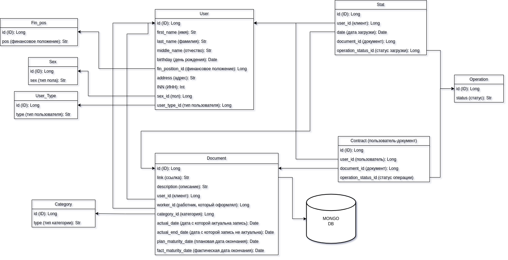

# MAI-practice-API-gateway-for-integration-with-banking-systems

Разработка API-шлюза для интеграции с банковскими системами

---

# Оглавление

- [MAI-practice-API-gateway-for-integration-with-banking-systems](#mai-practice-api-gateway-for-integration-with-banking-systems)
- [Оглавление](#оглавление)
- [Техническое задание](#техническое-задание)
  - [Цель и функциональные требования](#цель-и-функциональные-требования)
  - [Критерии оценивания](#критерии-оценивания)
- [Описание функциональности банковских систем](#описание-функциональности-банковских-систем)
  - [Система дистанционного банковского обслуживания (ДБО)](#система-дистанционного-банковского-обслуживания-дбо)
  - [Автоматизированная банковская система (АБС)](#автоматизированная-банковская-система-абс)
  - [Система управления (СМ)](#система-управления-см)
- [План выполнения работ](#план-выполнения-работ)
  - [Этап 1: Проектирование](#этап-1-проектирование)
  - [Этап 2: Разработка базового функционала](#этап-2-разработка-базового-функционала)
  - [Этап 3: Тестирование и оптимизация](#этап-3-тестирование-и-оптимизация)
- [**Стек технологий**](#стек-технологий)
- [Ход работы](#ход-работы)
  - [Проектирование БД под задачу](#проектирование-бд-под-задачу)
      - [**1. Fin\_pss (Финансовое положение)**](#1-fin_pss-финансовое-положение)
      - [**2. User\_type (Тип пользователя)**](#2-user_type-тип-пользователя)
      - [**3. User (Пользователь)**](#3-user-пользователь)
      - [**4. Callcopy (Категория документов)**](#4-callcopy-категория-документов)
      - [**5. Document (Документ)**](#5-document-документ)
      - [**6. Stat (Статистика загрузки)**](#6-stat-статистика-загрузки)
      - [**7. Operation (Статусы операций)**](#7-operation-статусы-операций)
      - [**8. Contract (Контракты)**](#8-contract-контракты)
    - [Интеграция:](#интеграция)
- [Эндпоинты и примеры запросов](#эндпоинты-и-примеры-запросов)
- [Зависимости](#зависимости)


---

# Техническое задание

## Цель и функциональные требования
- [ ] Разработать API-шлюз для взаимодействия с банковскими системами:
  - [ ] ДБО (Дистанционное банковское обслуживание) – для загрузки документов клиентами.
  - [ ] АБС (Автоматизированная банковская система) – для хранения и
обработки документов.
  - [ ] СМ (Система управления) – для привязки документов к карточкам контрактов.
- [ ] Обеспечить защиту API с использованием OAuth 2.0/JWT.
- [ ] Разработать версионность API для поддержки будущих изменений.

## Критерии оценивания
- [ ] Документ со схемой API, описанием эндпоинтов и форматов запросов.
- [ ] Прототип API-шлюза (FastAPI, PostgreSQL).
- [ ] Тестовый сценарий передачи документов между сервисами.

---

# Описание функциональности банковских систем


## Система дистанционного банковского обслуживания (ДБО)

**Дистанционное банковское обслуживание (ДБО)** — это технология, позволяющая клиентам банка (физическим и юридическим лицам) управлять своими банковскими счетами и совершать финансовые операции удалённо, без необходимости посещения отделений банка.

В данном проекте **service** ДБО должен обеспечить загрузку документа на сервер и передать документ в **service** АБС, чтобы он сохранил документ на **NoSQL** базу данных. В добавок,  **service** ДБО должен предоставтить возможность чтения всех документов пользователя и получение документа по его **ID**.

- `GET /dbo/doc/{id}` - получение информации документа по ID
- `GET /dbo/find/user/documents/all` - получение всех файлов пользователя по ФИО в JSON
- `POST /dbo/load_document` - загрузка документа через тело запроса JSON.
  ```bash
  curl -X 'POST'   'http://127.0.0.1:8080/dbo/load_document'   -H 'accept: application/json'   -H 'Content-Type: multipart/form-data'   -F 'file=@app/resources/files_to_load/text.txt'
  ```

## Автоматизированная банковская система (АБС)

**Автоматизированная банковская система (АБС)** — это комплекс программных решений, обеспечивающий автоматизацию ключевых процессов банка, включая обработку транзакций, учёт операций, ведение счетов и управление рисками.

В данном проекта **service** АБС должен обеспечить сохранение файлов в **NoSQL** базу данных, удаление из базы данных файла. 

*ИДЕЯ: можно документы с сервиса ДБО запихивать в очередь, или наделять статусом не оформлен, а потом, после успешной загрузки выставлять статус о готовности.*

## Система управления (СМ)

Система управления (СМ) — это программный комплекс, предназначенный для администрирования и управления внутренними процессами банка, включая управление клиентами, контрактами, документами и бизнес-процессами.

В данном проекте **service** СМ должен поддерживать создание так называемых *КОНТРАКТОВ*, которые просто в БД являются связью *документ - клиент*.


Взаимодействие между сервисами идет через **СТАТУС** в БД

---

# План выполнения работ

## Этап 1: Проектирование

**Задачи**:

1. **Анализ требований**:
   - [X] Уточнить форматы данных для ДБО, АБС, СМ (JSON, спецификации полей).
   - [X] Определить роли пользователей и права доступа (например, клиент, администратор).

2. **Схема API**:
   - [ ] Описать эндпоинты для каждой системы:
     - [X] ДБО
     - [ ] АБС
     - [ ] СМ
   - [ ] Форматы запросов/ответов.

3. **Архитектура**:
   - [X] Выбрать FastAPI + PostgreSQL.
   - [X] Спроектировать базу данных (ER-диаграмма).
   - [ ] Решить, как хранить JWT (краткосрочные токены с рефреш-токенами).

**Метрики**:
- [X] Документ с OpenAPI-спецификацией.
- [X] ER-диаграмма БД.

## Этап 2: Разработка базового функционала

**Задачи**:

1. **Настройка проекта**:
   - [X] Инициализация FastAPI.
   - [X] Подключение PostgreSQL через SQLAlchemy.
   - [ ] Настройка Alembic для миграций.

2. **Реализация безопасности**:
   - [ ] OAuth2 с JWT: эндпоинт `/token`.
   - [ ] Middleware для проверки токенов.
   - [ ] Ролевая модель (например, `client`, `admin`).

3. **Базовые эндпоинты**:
   - [X] ДБО: Загрузка документов (сохранение в БД + заглушка для АБС).
   - [ ] АБС: Реализация хранения документов.
   - [ ] СМ: Привязка документа к контракту (проверка существования ID).

**Метрики**:
- [ ] Рабочий прототип на локальной машине.
- [ ] Успешная аутентификация через Postman.

## Этап 3: Тестирование и оптимизация

**Задачи**:

1. **Нагрузочное тестирование**:
   - [ ] Оптимизация запросов к БД (индексы, кэширование через Redis).

2. **Документация**:
   - [X] Swagger/Redoc для API.
   - [ ] Руководство для разработчиков (примеры запросов).

---

# **Стек технологий**
- **Backend**: FastAPI, SQLAlchemy, Pydantic.
- **База данных**: PostgreSQL + Redis (кэш).
- **Безопасность**: OAuth2, JWT, Let’s Encrypt.
- **Инфраструктура**: Docker, Kubernetes, AWS.
- **Тестирование**: pytest, Postman, Locust.

---

# Ход работы

## Проектирование БД под задачу

**Проектирование BD:**



#### **1. Fin_pss (Финансовое положение)**
- **Назначение**: Справочник финансовых статусов клиентов (например, "стабильный", "критический", "под наблюдением").
- **Поля**:
  - `id`: Уникальный идентификатор статуса.
  - `pos`: Название статуса.

#### **2. User_type (Тип пользователя)**
- **Назначение**: Определение ролей пользователей (клиент, сотрудник банка, администратор).
- **Поля**:
  - `id`: Уникальный идентификатор роли.
  - `type`: Название роли (например, "клиент", "оператор ДБО").

#### **3. User (Пользователь)**
- **Назначение**: Хранение персональных данных клиентов и сотрудников.
- **Поля**:
  - `id`: Уникальный идентификатор пользователя.
  - `first_name`, `last_name`, `middle_name`: ФИО.
  - `birthday`: Дата рождения.
  - `fin_position_id`: Ссылка на финансовый статус (из Fin_pss).
  - `address`: Адрес проживания.
  - `NN`: Налоговый номер (ИНН).
  - `sec_id`: Пол (требуется уточнение, возможна ошибка в названии).
  - `user_type_id`: Роль пользователя (из User_type).

#### **4. Callcopy (Категория документов)**
- **Назначение**: Классификация документов (например, "паспорт", "договор", "справка о доходах").
- **Поля**:
  - `id`: Уникальный идентификатор категории.
  - `type`: Название категории.

#### **5. Document (Документ)**
- **Назначение**: Хранение метаданных документов, загружаемых через ДБО.
- **Поля**:
  - `id`: Уникальный идентификатор документа.
  - `link`: Ссылка на файл в хранилище (АБС).
  - `description`: Описание документа.
  - `user_id`: Клиент, загрузивший документ.
  - `worker_id`: Сотрудник, обработавший документ.
  - `callcopy_id`: Категория документа (из Callcopy).
  - `actual_date`, `actual_end_date`: Период актуальности документа.
  - `plan_maturity_date`, `fact_maturity_date`: Плановые и фактические сроки обработки.

#### **6. Stat (Статистика загрузки)**
- **Назначение**: Отслеживание статусов загрузки документов.
- **Поля**:
  - `id`: Уникальный идентификатор записи.
  - `user_id`: Клиент.
  - `date`: Дата загрузки.
  - `document_id`: Ссылка на документ.
  - `operation_status_id`: Текущий статус (например, "в обработке", "подтвержден").

#### **7. Operation (Статусы операций)**
- **Назначение**: Справочник возможных статусов операций (например, "успешно", "ошибка", "требует проверки").
- **Поля**:
  - `id`: Уникальный идентификатор статуса.
  - `status`: Название статуса.

#### **8. Contract (Контракты)**
- **Назначение**: Привязка документов к контрактам клиентов (интеграция с СМ).
- **Поля**:
  - `id`: Уникальный идентификатор связи.
  - `user_id`: Клиент.
  - `document_id`: Документ.
  - `operation_status_id`: Статус операции (например, "активен", "архивирован").

### Интеграция:
1. **ДБО**: 
   - Загрузка документов реализуется через таблицу **Document** и **Stat**.
   - Клиенты аутентифицируются через **User** (необходимо добавить поля для логина и пароля).
2. **АБС**: 
   - Хранение документов (поле `link` в **Document**).
   - Обработка документов (поля `worker_id`, `plan_maturity_date`).
3. **СМ**: 
   - Привязка документов к контрактам через таблицу **Contract**.
4. **Защита API**: 
   - Для OAuth 2.0/JWT требуется расширить таблицу **User** (добавить `login`, `password_hash`, `token`).
5. **Версионность API**: 
   - Требуется отдельная таблица для управления версиями (например, **ApiVersion** с полями `version`, `deprecation_date`).


# Эндпоинты и примеры запросов

<!-- TODO: добавить скрин с swagger -->

# Зависимости

```bash
sudo apt install python3-dev libpq-dev gcc
```


